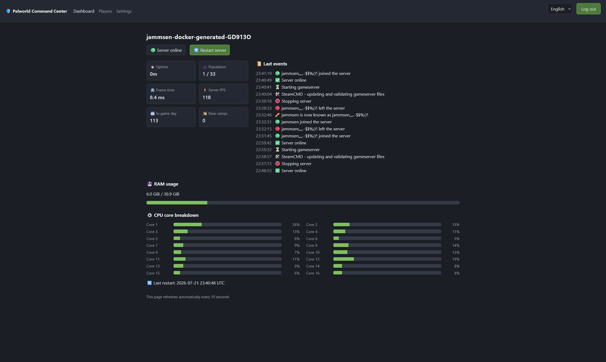
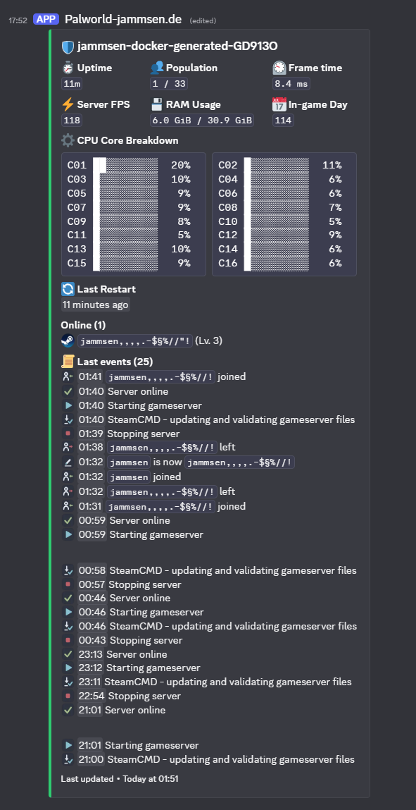

# Docker - Palworld Companion

[](https://github.com/jammsen/docker-palworld-companion/actions/workflows/docker-build-and-push-develop.yml)
[](https://hub.docker.com/r/jammsen/palworld-companion)
[](https://discord.gg/7tacb9Q6tj)

Companion **sidecar container** for [jammsen/docker-palworld-dedicated-server](https://github.com/jammsen/docker-palworld-dedicated-server): a web operation panel and a Discord live status card for your Palworld dedicated server, running as its own container next to the gameserver.

> **[Join us on Discord](https://discord.gg/7tacb9Q6tj)**

## Features

### Web operation panel

- **Dashboard** - server status, uptime, population, server frame time, server FPS, in-game day, host RAM usage, per-CPU-core load and the last-events log
- **Players** - online players with level/ping/buildings, kick/ban/unban and the ban list
- **Settings editor** - every `PalWorldSettings.ini` value with validation, grouped and translated (English + 中文); saved changes are stored as overrides on the companion volume and applied by the gameserver at its next restart
- **One-click restart** with in-game announce and world save
- **Discord page** - own menu entry: in bot mode the channels, presence, update interval and command toggle are editable at runtime, in webhook mode the webhook URL and interval (the bot token stays env-only)
- Login-protected; sessions survive restarts



### Discord live status card

**One single Discord message** that the companion keeps editing in place - a live status card with uptime, population, server frame time, server FPS, host RAM, per-core CPU bars, last restart, the online player list (with platform icons) and a last-events log. In **webhook mode** no Discord bot account is needed - a plain channel webhook is enough. In **bot mode** (a developer-app token) the bot additionally appears as an online member with a live player-count activity, can stream every server event into a dedicated logs channel, and offers slash commands - `/status` and `/players` for everyone, `/kick` `/ban` `/unban` `/restart` permission-gated and restricted to an admin channel that also receives an audit line for every admin action. The message survives container restarts either way.



Ready-made icon sets for the event log ship in [`icons/`](icons/) - see [Custom event icons](#custom-event-icons).

## How it works

The companion talks to the gameserver's REST API over the container network and exchanges files over two **one-way volume mounts** - each container owns exactly one writable surface, the other side mounts it read-only:

- The **game volume** (gameserver-owned): the companion reads `game-events.log`, the generated `PalWorldSettings.ini` and the ban list.
- The **companion data volume** (companion-owned): the panel writes `settings-overrides.env` here; the gameserver reads it at boot and applies the overrides with the highest precedence.

The complete interface is documented in [CONTRACT.md](CONTRACT.md).

## Getting started

**Recommended:** use the [gameserver repo's](https://github.com/jammsen/docker-palworld-dedicated-server) `compose.yml` + `default.env` - the companion is already integrated there as a second service, disabled by default, and both containers share one env file. Your whole server is one directory:

```text
.
├── companion    # companion data dir (created on first start)
├── compose.yml  # both services
├── default.env  # ALL variables for both services, in one file
└── game         # game data dir
```

If you wire it up yourself instead, this is the equivalent setup:

```yaml
services:
  palworld-dedicated-server:
    container_name: palworld-dedicated-server
    image: jammsen/palworld-dedicated-server:latest
    # ... your existing gameserver configuration (ports etc.) ...
    env_file:
      # Shared config: RESTAPI_ENABLED=true and ADMIN_PASSWORD in here are
      # required on BOTH services for the companion to reach the REST API
      - ./default.env
    environment:
      COMPANION_DATA_DIR: /companion-data
    volumes:
      - ./game:/palworld
      - ./companion:/companion-data:ro

  companion:
    container_name: palworld-companion
    image: jammsen/palworld-companion:latest
    restart: unless-stopped
    depends_on:
      - palworld-dedicated-server
    ports:
      # Uncomment to reach the web panel (Needs: PANEL_ENABLED=true)
      # Warning! DO NOT expose this port to the internet, use a reverse proxy or VPN/LAN only
      - target: 8213
        published: 8213
        protocol: tcp
    env_file:
      - ./default.env
    environment:
      RESTAPI_HOST: palworld-dedicated-server
      COMPANION_DATA_DIR: /data
    volumes:
      - ./game:/palworld:ro
      - ./companion:/data
```

The container starts as root, chowns its data dir to `PUID:PGID` (default `1000:1000`, same contract as the gameserver image) and drops privileges - a root-owned `./companion` dir created by Docker heals itself on first start.

Then enable the features you want in your `default.env`:

```shell
# Web panel
PANEL_ENABLED=true
PANEL_PASSWORD=choose-a-strong-password

# Discord live status card
DISCORD_STATUS_ENABLED=true
DISCORD_STATUS_WEBHOOK_URL=https://discord.com/api/webhooks/...
```

Both features need `RESTAPI_ENABLED=true` and `ADMIN_PASSWORD` set on the gameserver - the companion uses the same values to reach the REST API.

> **Security warning:** The panel speaks plain HTTP - do **NOT** publish port 8213 to the internet. Use it LAN/VPN-only or put a TLS reverse proxy (Caddy, Traefik, nginx) in front.

All environment variables are documented in [docs/ENV_VARS.md](docs/ENV_VARS.md).

## Discord bot mode

Webhook mode (above) only needs a channel webhook URL. **Bot mode** upgrades the card to a real bot: an online member with a live player-count activity, an optional logs channel streaming every server event, an optional admin channel that restricts and audits moderation, and the slash commands `/status` `/players` (public) and `/kick` `/ban` `/unban` `/restart` (permission-gated). Setting a bot token switches the mode:

```shell
DISCORD_STATUS_ENABLED=true
DISCORD_BOT_TOKEN=your-bot-token          # switches the card from webhook to bot mode
DISCORD_STATUS_CHANNEL_ID=123456789...    # channel of the live status card
DISCORD_LOGS_CHANNEL_ID=                  # optional: every server event as a message
DISCORD_ADMIN_CHANNEL_ID=                 # optional: restricts + audits moderation commands
DISCORD_GUILD_ID=                         # your server id - required for slash commands
DISCORD_COMMANDS_ENABLED=true             # slash commands (needs the guild id)
```

In short: create an application in the [Discord Developer Portal](https://discord.com/developers/applications), grab the token from its **Bot** page, invite the bot via the **OAuth2 URL Generator** (scopes `bot` + `applications.commands`), copy the channel/server ids with Developer Mode enabled, fill in `default.env` and `docker compose up -d`.

**➡️ Follow the [click-by-click Bot mode walkthrough](docs/ENV_VARS.md#bot-mode)** - every step from "New Application" to the card appearing, including the channel-permission and privileged-intents details. In bot mode the panel gets a "Discord" settings group where channels, presence, interval and the commands toggle are editable at runtime.

## Custom event icons

The last-events log ships with proper icons out of the box (the `icons/modern-slate` set). To use another set - or your own icons:

1. Pick a set from [`icons/`](icons/) (31 ready-made sets, 16 PNGs each) - the [side-by-side overview](icons/README.md) shows every set in one place, and each set directory has its own README with larger previews.
2. **Upload the 16 PNGs** to the Discord server your webhook lives in: Server Settings → Emoji → Upload Emoji.
3. **Get each token**: type the emoji with a leading backslash in any channel (e.g. `\:pal_join:`) and send - Discord prints the raw token like `<:pal_join:1234567890123456789>`.
4. Set the matching `DISCORD_STATUS_EMOJI_EVENT_*` variables - see [docs/ENV_VARS.md](docs/ENV_VARS.md).

Any variable left empty keeps its unicode default. The web dashboard keeps the unicode emojis - Discord custom emojis only render inside Discord.

## Development

```bash
npm ci
npm run dev    # tsx watch, loads dev/dev.env (panel on :8213, GAME_ROOT=./tmp-gameroot)
npm run mock   # mock Palworld REST API server for local development
npm run lint   # Biome - lint + format check (lint:fix applies safe fixes)
npm test
npm run build  # bundle to dist/companion.mjs
```

The Docker image build runs typecheck, unit tests and the bundle build - a broken test fails the build.
