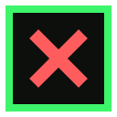
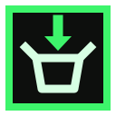
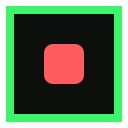
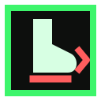
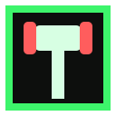
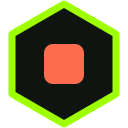

# Ready-made Discord icon sets

**31 sets** in 4 style families, **16 event icons each** (128x128 PNG) - made for
**Server Settings -> Emoji -> Upload Emoji** and the `DISCORD_STATUS_EMOJI_EVENT_*`
variables ([docs/ENV_VARS.md](../docs/ENV_VARS.md)). Every set keeps the same semantic
coloring: green family for joins/positive events, red family for leaves/negative ones,
the set's accent for the rest. The Pal-Sphere sets follow the in-game sphere tier colors.
Click a set name for its own page with larger previews.

Icon order in every strip below:
`join` `leave` `rename` `online` `offline` `starting` `installing` `updating` `updating-validate` `stopping` `restart` `backup` `settings` `kick` `ban` `unban`

Regenerate or add sets with [`gen.mjs`](./gen.mjs) (instructions in its header).

## Modern (6 sets)

Flat squircles with muted, considered backgrounds.

| Set | Icons |
| --- | --- |
| [`modern-deepmint`](./modern-deepmint/README.md) |                 |
| [`modern-indigofade`](./modern-indigofade/README.md) |                 |
| [`modern-monoink`](./modern-monoink/README.md) |                 |
| [`modern-porcelain`](./modern-porcelain/README.md) |                 |
| [`modern-slate`](./modern-slate/README.md) |                 |
| [`modern-sunsetclay`](./modern-sunsetclay/README.md) |                 |

## Cool (6 sets)

Neon rings and gradients on near-black.

| Set | Icons |
| --- | --- |
| [`cool-ember`](./cool-ember/README.md) |                 |
| [`cool-glacier`](./cool-glacier/README.md) |                 |
| [`cool-neoncyan`](./cool-neoncyan/README.md) |                 |
| [`cool-neonmagenta`](./cool-neonmagenta/README.md) |                 |
| [`cool-synthwave`](./cool-synthwave/README.md) |                 |
| [`cool-volt`](./cool-volt/README.md) |                 |

## Gaming (6 sets)

Esports-style hex, shield, octagon and pixel badges.

| Set | Icons |
| --- | --- |
| [`gaming-carbonocta`](./gaming-carbonocta/README.md) |                 |
| [`gaming-crimsonhex`](./gaming-crimsonhex/README.md) |                 |
| [`gaming-goldhex`](./gaming-goldhex/README.md) |                 |
| [`gaming-pixelgrid`](./gaming-pixelgrid/README.md) |                 |
| [`gaming-royalshield`](./gaming-royalshield/README.md) |                 |
| [`gaming-toxin`](./gaming-toxin/README.md) |                 |

## Palworld (13 sets)

The ten in-game pal sphere tiers (radar excluded) plus meadow, sky and night world motifs.

| Set | Icons |
| --- | --- |
| [`pal-meadow`](./pal-meadow/README.md) |                 |
| [`pal-midnight`](./pal-midnight/README.md) |                 |
| [`pal-skyfall`](./pal-skyfall/README.md) |                 |
| [`pal-sphere-ancient`](./pal-sphere-ancient/README.md) |                 |
| [`pal-sphere-classic`](./pal-sphere-classic/README.md) |                 |
| [`pal-sphere-exotic`](./pal-sphere-exotic/README.md) |                 |
| [`pal-sphere-giga`](./pal-sphere-giga/README.md) |                 |
| [`pal-sphere-hyper`](./pal-sphere-hyper/README.md) |                 |
| [`pal-sphere-legendary`](./pal-sphere-legendary/README.md) |                 |
| [`pal-sphere-mega`](./pal-sphere-mega/README.md) |                 |
| [`pal-sphere-sol`](./pal-sphere-sol/README.md) |                 |
| [`pal-sphere-ultimate`](./pal-sphere-ultimate/README.md) |                 |
| [`pal-sphere-ultra`](./pal-sphere-ultra/README.md) |                 |
